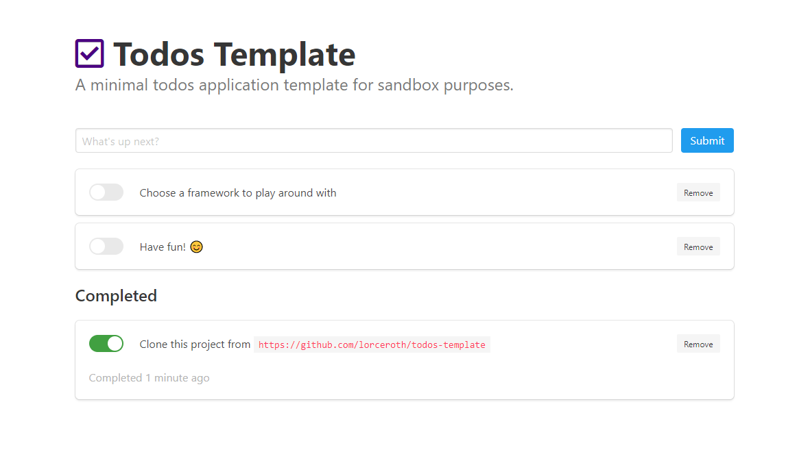

# Todos Template

A ready-made template for simple todo applications. This template is perfect for trying out frameworks and perform classic CRUD-operations.



## Requirements

If you wish to build the assets locally, you need to have the following installed on your machine:

- Node 10.15.0 or higher
- NPM 6.4.1
- Yarn 1.15.2 (optional)

## Get started

To get started, simply clone the project:

```bash
$ git clone https://github.com/lorceroth/todos-template.git
```

The files are already build and available in the `public` folder:

- app.css
- index.html

If you'd like to make customizations to the SASS-file, see the [requirements](#requirements) above.

Enjoy!
